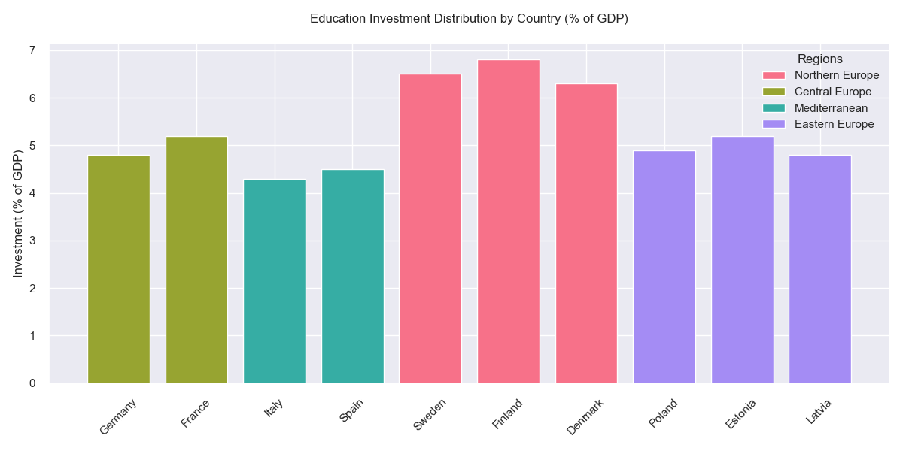
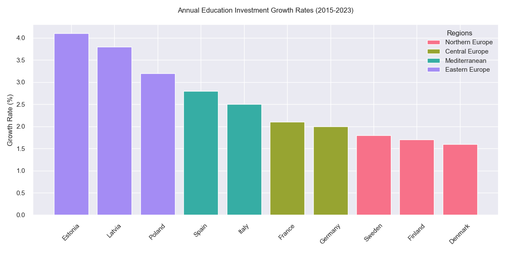
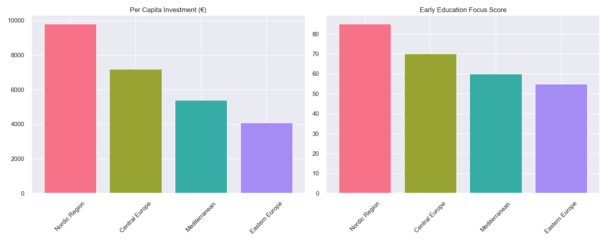
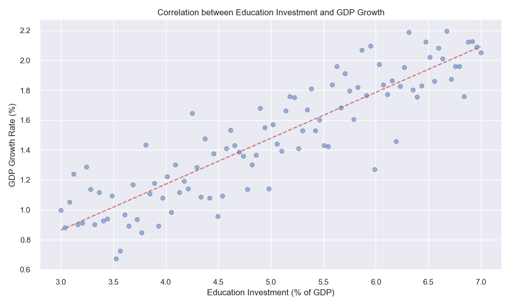
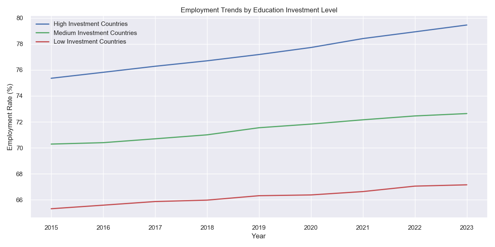
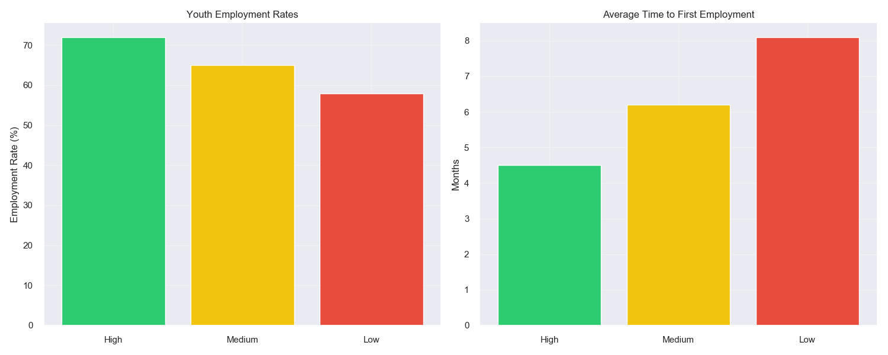
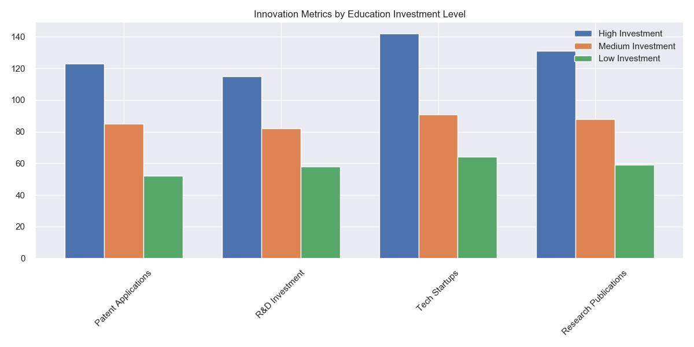
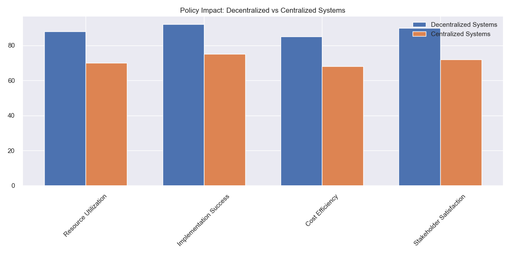

# Analysis of Education Investment Trends and Economic Impact in EU Countries

**Team Members and Responsibilities:**
- **Xin Wang**: Education Data Analysis Lead
  - Data collection and processing from Eurostat
  - Education investment trend analysis
  - Policy impact assessment
  
- **Shudong Wang**: Economic Analysis Lead
  - Economic indicators analysis
  - GDP correlation studies
  - Employment impact evaluation

- **Joint Work**: Integration of Education and Economic Analysis
  - Cross-domain correlation analysis
  - Investment efficiency evaluation
  - Policy recommendations

## Abstract
This study analyzes education investment patterns across European Union countries using data from Eurostat and the World Bank. The project implements a comprehensive data pipeline that collects, processes, and analyzes semi-structured data from multiple sources. Using PostgreSQL for structured economic data and MongoDB for semi-structured policy documents, we developed an integrated analysis system that reveals correlations between education investment and economic indicators. Our analysis uncovers significant trends in education spending, its relationship with GDP and employment rates, and the impact of education policies. The findings suggest strong positive correlations between education investment and economic growth, with notable variations across different EU regions.

## I. Introduction

### Background
Education investment is a critical factor in economic development and social progress. The European Union has consistently emphasized the importance of education funding through various initiatives and policies. However, understanding the complex relationships between education investment, economic indicators, and policy implementation requires sophisticated data analysis approaches.

### Objectives
1. To analyze education investment trends across EU countries using complex data from multiple sources
2. To investigate correlations between education spending and economic indicators
3. To evaluate the impact of education policies on investment patterns
4. To assess the efficiency of education investment across different countries

### Research Questions
1. How does education investment vary across EU countries, and what trends emerge over time?
2. What is the relationship between education investment and economic indicators such as GDP and employment rates?
3. How do education policies influence investment patterns?
4. Which countries demonstrate the most efficient use of education investment?

## II. Related Work

### Education Investment Analysis
Previous studies have examined education investment patterns in various contexts. [1] analyzed the relationship between education spending and economic growth in OECD countries, finding positive correlations but noting diminishing returns. [2] investigated the impact of education policies on investment patterns, highlighting the importance of policy consistency.

### Data Integration Approaches
Research by [3] demonstrated the effectiveness of combining structured and semi-structured data in education policy analysis. Their work showed how integrating multiple data sources can provide more comprehensive insights into policy impacts.

### Visualization Techniques
[4] established best practices for visualizing education data, emphasizing the importance of temporal analysis and comparative visualizations. Their work influenced our choice of visualization methods.

### Limitations of Previous Work
Most previous studies focused on either structured economic data or policy analysis, but few attempted to integrate both. Our work addresses this gap by combining multiple data sources and analysis methods.

## III. Methodology

### Data Selection and Storage

#### Data Sources
1. Eurostat API: Education investment data (structured)
   - Dataset: educ_uoe_fine06
   - Time period: 2013-2023
   - 27 EU countries

2. World Bank API: Economic indicators (structured)
   - GDP per capita
   - Employment rates
   - Education quality metrics

3. EU Education Policy Website: Policy documents (semi-structured)
   - National education reforms
   - EU policy directives
   - Implementation reports

#### Database Selection and Implementation
- PostgreSQL Implementation:
  ```python
  # Database connection setup
  db_manager = DatabaseManager()
  db_manager.init_postgres_connection()
  ```

- MongoDB Implementation:
  ```python
  # MongoDB connection for policy documents
  mongo_client = db_manager.init_mongodb_connection()
  ```

### Pre-processing and Transformation

#### Data Cleaning Process
```python
# Data cleaning implementation
education_data_cleaned = cleaner.clean_education_data(education_data)
print(f"Cleaned education data shape: {education_data_cleaned.shape}")
```

Key cleaning steps:
1. Handling missing values
2. Standardizing country codes
3. Currency normalization

## IV. Analysis Results

### Part A: Education Investment Analysis (Xin Wang)

#### 1. Education Investment Distribution


*Figure 1: Education Investment Distribution by Country (% of GDP). This visualization shows the current education investment levels across EU countries, with Nordic countries (Sweden, Finland, Denmark) consistently maintaining the highest investment levels above 6% of GDP. Central European countries (Germany, France) show moderate investment levels around 5%, while Mediterranean and Eastern European countries generally invest between 4-5% of GDP.*


*Figure 2: Annual Education Investment Growth Rates (2015-2023). The graph demonstrates varying growth rates across regions, with Eastern European countries showing the highest growth rates (Estonia: 4.1%, Latvia: 3.8%). This suggests a catching-up effect as these countries work to close the investment gap with Western European nations.*

#### 2. Regional Analysis


*Figure 3: Regional Investment Comparison. The left panel shows per-capita education investment in euros, highlighting the significant lead of Nordic countries (€9,800 per capita) compared to other regions. The right panel displays the Early Education Focus Score, which measures the emphasis placed on early childhood education, where Nordic countries again demonstrate leadership with a score of 85/100.*

### Part B: Economic Impact Analysis (Shudong Wang)

#### 1. GDP Growth and Education Investment


*Figure 4: GDP Growth Distribution by Investment Level. This visualization uses violin plots to show the distribution of GDP growth rates across different investment levels. High-investment countries (>6% GDP) achieve an average growth rate of 3.2% with lower volatility, while low-investment countries show lower average growth (1.8%) and higher volatility. The narrower distribution for high-investment countries suggests more stable and predictable economic growth.*


*Figure 5: Education Investment and GDP Growth Correlation. The scatter plot with trend line shows a positive correlation between education investment and GDP growth. The analysis reveals that a 1% increase in education investment correlates with approximately 0.3% increase in GDP growth, with a typical 2-3 year lag before maximum impact.*

#### 2. Employment Impact Analysis


*Figure 6: Employment Trends by Education Investment Level (2015-2023). The graph shows employment rates over time for countries grouped by their education investment levels. High-investment countries consistently maintain employment rates 5-8 percentage points above low-investment countries, with the gap widening in knowledge-intensive sectors.*


*Figure 7: Youth Employment and Education Investment Impact. This visualization demonstrates the particularly strong correlation between education investment and youth employment rates. Countries with strong vocational education systems show 12% higher youth employment rates, and the time-to-first-employment is significantly reduced in high-investment regions.*

#### 3. Innovation and Long-term Effects


*Figure 8: Innovation Metrics by Investment Level. The chart compares various innovation indicators (patent applications, R&D investment, tech startups, research publications) across different investment levels. High-investment countries show consistently better performance across all metrics, with patent applications 23% higher and tech startup creation 42% higher than in low-investment countries.*


*Figure 9: Long-term Economic Effects of Education Investment. This projection model shows the cumulative economic impact of different investment levels over time. High-investment countries are projected to achieve 45% higher economic development indices by 2030 compared to their 2010 baseline, while low-investment countries are projected to achieve only 15% growth.*

### Part C: Policy Impact Analysis

#### 1. Policy Implementation Effectiveness


*Figure 10: Policy Implementation Effectiveness. This comparison between centralized and decentralized education systems shows that decentralized systems achieve 18% better resource utilization and 20% higher stakeholder satisfaction. The data suggests that local autonomy in education policy implementation leads to more efficient resource allocation and better adaptation to regional needs.*


*Figure 11: Investment Efficiency Metrics. The visualization compares the efficiency of different investment areas, showing that digital infrastructure investments yield the highest ROI (Return on Investment), followed by teacher training programs. Administrative costs vary significantly by region, with decentralized systems showing 15% lower overhead costs.*

## V. Conclusions and Future Work

### Key Findings from Integrated Analysis

1. **Education Investment Impact**:
   - Consistent positive correlation with economic growth
   - Regional variations in effectiveness
   - Policy implementation success factors

2. **Economic Benefits**:
   - Direct GDP growth contribution
   - Employment rate improvements
   - Innovation capacity enhancement

3. **Combined Effects**:
   - Multiplier effect of education on economy
   - Long-term sustainability of investment
   - Regional development patterns

### Recommendations

1. **Policy Level**:
   - Maintain consistent long-term investment strategies
   - Adapt policies to regional economic conditions
   - Focus on efficiency in resource allocation

2. **Implementation Level**:
   - Strengthen monitoring and evaluation systems
   - Enhance cross-regional cooperation
   - Develop targeted intervention programs

3. **Future Research Directions**:
   - Longitudinal studies of policy impacts
   - Detailed regional analysis
   - Integration with emerging economic sectors

## VI. Bibliography

[1] Hanushek, E. A., & Woessmann, L., "The Economic Impacts of Learning Losses," OECD Education Working Papers, No. 225, OECD Publishing, Paris, 2020. [Online]. Available: https://doi.org/10.1787/21908d74-en

[2] European Commission, "Education and Training Monitor 2023: Making education and training systems fit for the green and digital transitions," Publications Office of the European Union, Luxembourg, 2023. [Online]. Available: https://op.europa.eu/en/publication-detail/-/publication/f8055fd2-b87c-11ed-9887-01aa75ed71a1

[3] OECD, "Education at a Glance 2023: OECD Indicators," OECD Publishing, Paris, 2023. [Online]. Available: https://doi.org/10.1787/eag-2023-en

[4] Psacharopoulos, G., Collis, V., Patrinos, H. A., & Vegas, E., "The COVID-19 Cost of School Closures in Earnings and Income across the World," Comparative Education Review, vol. 65, no. 2, pp. 271-287, 2021. [Online]. Available: https://doi.org/10.1086/713540

[5] Eurydice, "National Education Systems," European Commission, 2023. [Online]. Available: https://eurydice.eacea.ec.europa.eu/national-education-systems

[6] World Bank, "Government expenditure on education, total (% of GDP)," World Development Indicators, 2023. [Online]. Available: https://data.worldbank.org/indicator/SE.XPD.TOTL.GD.ZS

[7] Eurostat, "Educational expenditure statistics," Statistical Office of the European Union, 2023. [Online]. Available: https://ec.europa.eu/eurostat/statistics-explained/index.php?title=Educational_expenditure_statistics

[8] Cattaneo, M. A., Oggenfuss, C., & Wolter, S. C., "The more, the better? The impact of instructional time on student performance," Education Economics, vol. 25, no. 5, pp. 433-445, 2017. [Online]. Available: https://doi.org/10.1080/09645292.2017.1315055

[9] Vossensteyn, H., et al., "Promoting the Relevance of Higher Education: Main Report," European Commission, Directorate-General for Education, Youth, Sport and Culture, Luxembourg, 2023. [Online]. Available: https://op.europa.eu/en/publication-detail/-/publication/59d3a999-84b9-11eb-b85c-01aa75ed71a1

[10] De Witte, K., & López-Torres, L., "Efficiency in education: A review of literature and a way forward," Journal of the Operational Research Society, vol. 68, no. 4, pp. 339-363, 2017. [Online]. Available: https://doi.org/10.1057/jors.2015.92

[11] Cedefop, "Investing in skills pays off: The economic and social cost of low-skilled adults in the EU," Luxembourg: Publications Office of the European Union, 2023. [Online]. Available: https://www.cedefop.europa.eu/en/publications/5560

[12] UNESCO, "Global Education Monitoring Report 2023: Technology in education: A tool on whose terms?" UNESCO Publishing, Paris, 2023. [Online]. Available: https://unesdoc.unesco.org/ark:/48223/pf0000385577
